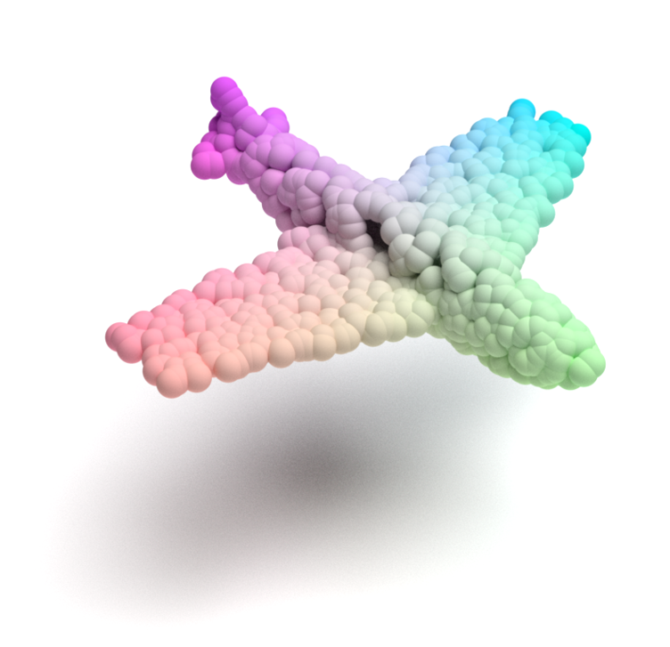
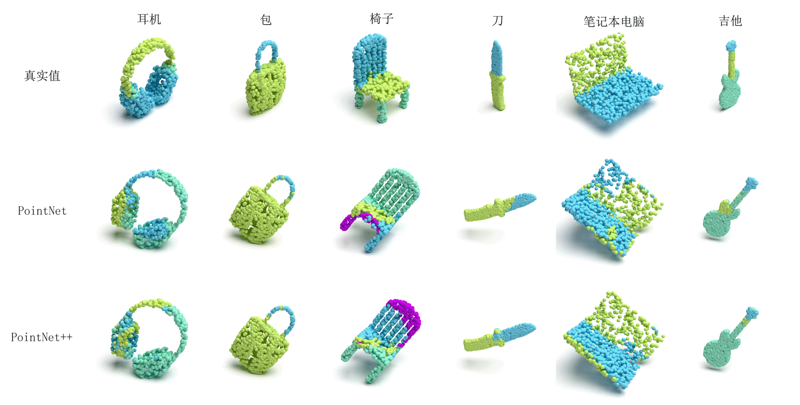

# PointRenderer
A point renderer for point cloud using mitsuba.

Instructions and scripts for rendering point cloud figures shown in **一种基于自监督学习的矢量球面卷积网络, 自动化学报, DOI:  10.16383/j.aas.c220694**.

[Paper](http://www.aas.net.cn/cn/article/doi/10.16383/j.aas.c220694)

## Dependencies

- Python 3.6++(Based on individual practice)
- [Mitsuba Renderer](http://www.mitsuba-renderer.org/)

## How to use

Clone whole project to `Your Path`.

```bash
git clone https://github.com/chenkxin/PointRenderer.git
```

Try default mode simply, just run `point_colorful.py` file.

```bash
python point_colorful.py
```

It will generate the `mitsuba_scene.xml` file that contain the detail configs for rendering using mitsuba.

Then use `mitsuba` to render the model:

```bash
mitsuba mitsuba_scene.xml
```

**Tips:** You need to make sure that the **`mitsuba`** has been successfully installed in your environment and that **the relevant environment variables** and **quick-run commands** are configured. The `Mitsuba` installation process can be found in the `reference` folder.



## How to deployed to 3D part segmentation

You can view the `segmentation` folder which contains `point_colorful_seg.py` to generate multiple xml files.

I also provide a simple shell script for batch rendering multiple models quickly, see `render_seg.sh`.

Some experimental results are shown below:



## How to merge models from multiple orientations

This is as simple as adding points from multiple models to the same configuration file.


## Cite

Please consider citing our work if you find it useful:

```latex
@articleInfo{AAS-CN-2022-0694,
title = "一种基于自监督学习的矢量球面卷积网络",
journal = "自动化学报",
volume = "49",
number = "AAS-CN-2022-0694,
pages = "1",
year = "2023",
note = "",
issn = "0254-4156",
doi = "10.16383/j.aas.c220694",
url = "http://www.aas.net.cn/article/doi/10.16383/j.aas.c220694",
author = "陈康鑫","赵杰煜","陈豪",
keywords = "矢量球面卷积网络","自监督学习","三维目标分类","三维目标部分分割",
}
```

